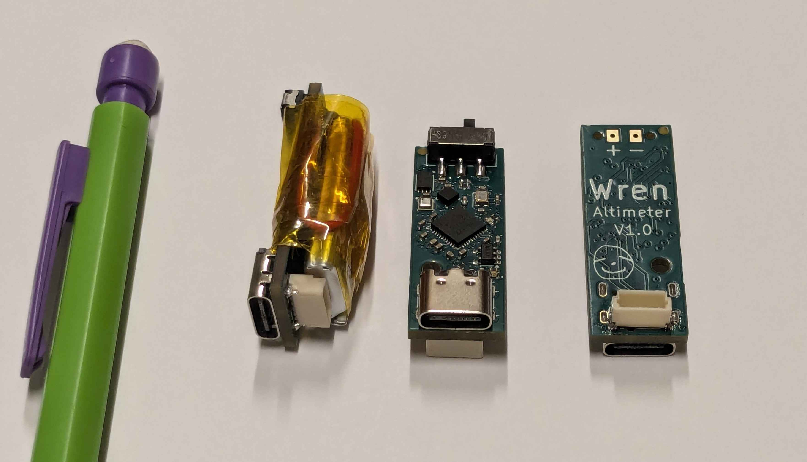
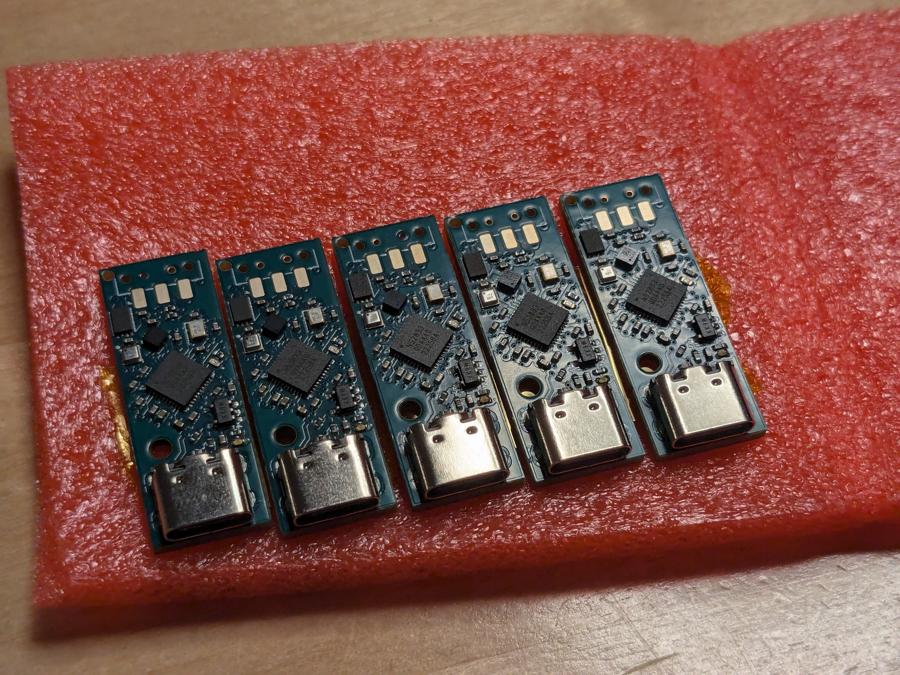
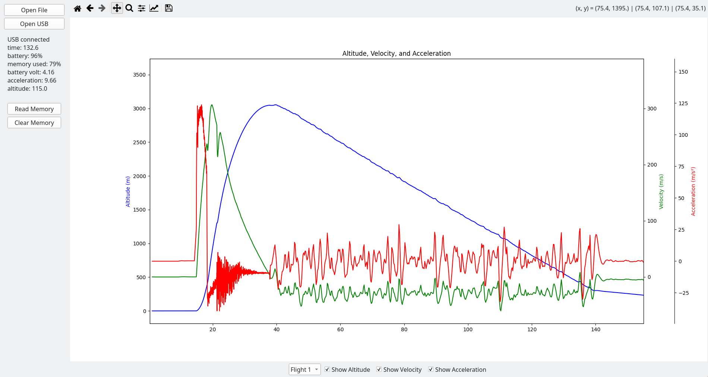

# Wren
Wren is an altimeter small enough to fit in a standard 18mm model rocket. It is designed to be assembled by JLCPCB for as low of a price as possible. The altitude, velocity and acceleration are sampled and saved at 50Hz. The battery should last for tens of hours while waiting for a launch and is charged through USB-C

## Hardware
A 12mm x 34mm 4 layer PCB, designed to only use components from JLCPCB's stock. Single sided assembly with only a debug connector and battery pads on the back.

1. **MCU:** A low-power nRF52833.

1. **Accelerometer:** A LIS2DH rotated 45° allowing it to measure accelerations up to 22.5G instead of the typical 16G limit.

1. **Barometer:** A BMP390 for altitude measurements.

1. **Flash Memory:** 4Mbit of onboard flash. Should log ~10 flights at 50Hz.

1. **Battery:** LiPo charging at 30mA.

## Firmware
The onboard firmware is being developed using Rust with the Embassy framework.

### Flashing
First you need to flash the bootloader. CD into the `firmware/bootloader/` directory and then run

`cargo run --release`

After the bootloader is flashed, CD into the `firmware/` directory and run the same command. As long as the bootloader isn't changed you don't need to flash it again.

### Testing
To run the native test build with mock drivers run

`cargo run --target x86_64-unknown-linux-gnu` (or any arch with std)

## Software

To fetch data and manage the altimeter use the dashboard. Run `python main.py`