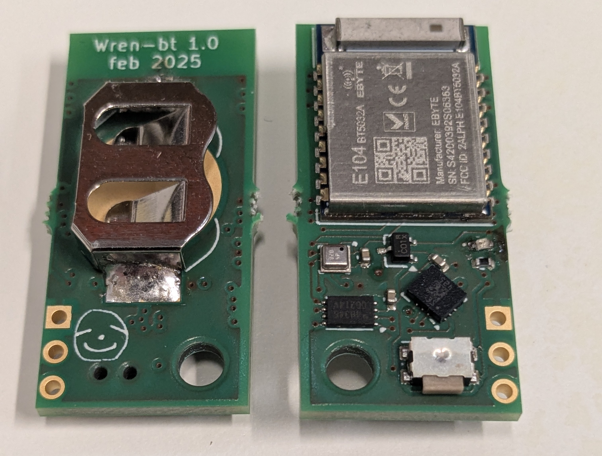

# Wren
Wren is an altimeter small enough to fit in a standard 18mm model rocket. It is designed to be assembled by JLCPCB for as low of a price as possible. The altitude, velocity and acceleration are sampled and saved at 50Hz. The battery should last for tens of hours while waiting for a launch and is charged through USB-C


## Hardware
A 12mm x 34mm 4 layer PCB, designed to only use components from JLCPCB's stock. Single sided assembly with only a debug connector and battery pads on the back.

1. **MCU:** A low-power nRF52833.

1. **Accelerometer:** A LIS2DH rotated 45° allowing it to measure accelerations up to 22.5G instead of the typical 16G limit.

1. **Barometer:** A BMP390 for altitude measurements.

1. **Flash Memory:** 4Mbit of onboard flash. Should log ~10 flights at 50Hz.

1. **Battery:** LiPo charging at 30mA.


# Firmware

The onboard firmware is developed in Rust using the [Embassy](https://embassy.dev/) framework.

## Flashing the Firmware

### 1. Flash the Bootloader
Before flashing the firmware, you must first flash the bootloader. Navigate to the `firmware/bootloader/` directory and run:

```bash
cargo run --release
```

### 2. Flash the Firmware
Once the bootloader is installed, navigate to the `firmware/` directory and run the same command:

```bash
cargo run --release
```

> **Note:** You only need to flash the bootloader once unless you modify it.

## Updating via USB
Once the bootloader is flashed, you can update the firmware directly over USB.

### 1. Build the Firmware Binary
Generate a binary file suitable for flashing:

```bash
cargo objcopy --release -- -O binary firmware.bin
```

This will create `firmware.bin` in the current directory.

### 2. Upload the Firmware
1. **Connect the board** to a USB port.
2. **Run the firmware updater script:**

   ```bash
   python firmware_updater.py ../firmware/firmware.bin
   ```

3. **Power cycle the board** – The updater intercepts the boot process to load the new firmware.

## Testing
To run a native test build with mock drivers, use:

```bash
cargo run --target x86_64-unknown-linux-gnu
```

*(Or any other architecture that supports the Rust standard library.)*

---

# Software


To fetch data and manage the altimeter, use the dashboard:

```bash
python dashboard/main.py
```

### WIP bluetooth version
